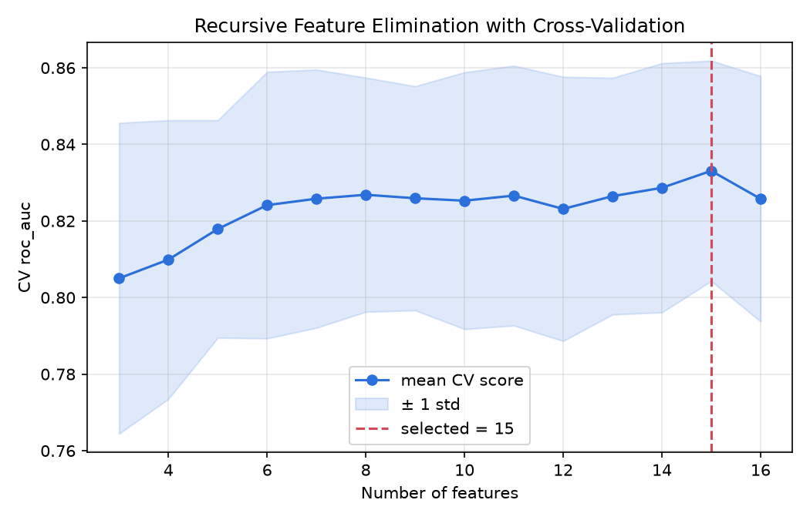
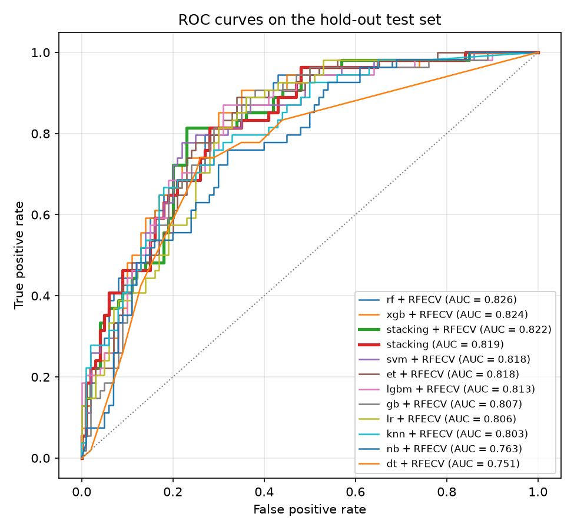

# Stacking Ensemble + RFECV for Type 2 Diabetes Mellitus Prediction

A reproducible machine-learning framework that predicts Type 2 Diabetes Mellitus (T2DM)
by combining **Recursive Feature Elimination with Cross-Validation (RFECV)** with a
**heterogeneous stacking ensemble**. It is evaluated on the PIMA Indians Diabetes dataset
(768 patients, 8 clinical measurements, 34.9 % positive).

## Framework

```
raw features (8)
   │  zeros in Glucose/BP/SkinThickness/Insulin/BMI → missing
   ▼
SimpleImputer (median)                     ┐
   ▼                                       │
ClinicalFeatureEngineer (+8 derived)       │  all steps live in one sklearn
   ▼                                       │  Pipeline, so they are re-fitted
StandardScaler                             │  on training folds only
   ▼                                       │  (no leakage into CV / test)
RFECV  (RandomForest ranker, 5-fold, AUC)  │
   ▼                                       │
StackingClassifier                         ┘
   level-0: LR · SVM (Platt) · KNN · RF · ExtraTrees · GradientBoosting · XGBoost · LightGBM
   level-1: Logistic Regression on 5-fold out-of-fold probabilities
```

* **Data cleaning** – physiologically impossible zeros are treated as missing values and
  imputed with the training-fold median.
* **Feature engineering** – 8 clinically motivated features are added (Glucose×BMI,
  Glucose×Age, HOMA-IR surrogate, insulin/glucose ratio, BMI×Age, obesity flag
  BMI ≥ 30, hyperglycaemia flag Glucose ≥ 140, pedigree×age), giving RFECV 16 candidates.
* **RFECV** – recursively drops the weakest feature (by importance) and keeps the subset
  with the best cross-validated ROC-AUC. Ranker, folds, metric and minimum subset size are
  configurable.
* **Stacking** – diverse base learners are trained on the selected features; their
  out-of-fold predicted probabilities feed a logistic-regression meta-learner.
* **Evaluation** – stratified 80/20 hold-out split. On the training part every model is
  compared *with* and *without* RFECV using stratified k-fold CV in which preprocessing
  and RFECV are re-fitted inside every fold. The final RFECV + stacking pipeline is then
  fitted on the full training set and scored once on the untouched test set.
  Metrics: accuracy, balanced accuracy, precision, recall (sensitivity), specificity, F1,
  MCC, ROC-AUC.

## Project layout

| Path | Purpose |
|---|---|
| `data/diabetes.csv` | PIMA Indians Diabetes dataset |
| `t2d/data.py` | loading and zero-as-missing cleaning |
| `t2d/features.py` | clinical feature engineering transformer |
| `t2d/models.py` | base learners, RFECV builder, stacking ensemble, full pipeline |
| `t2d/evaluation.py` | metrics, leakage-free CV comparison, summaries |
| `t2d/plots.py` | RFECV curve, feature ranking, ROC curves, confusion matrix |
| `t2d/train.py` | experiment CLI |
| `t2d/predict.py` | score new patients with a saved model |
| `results/` | metrics tables, figures and `report.json` from the reference run |
| `tests/` | pytest suite |

## Usage

```bash
pip install -r requirements.txt

# full experiment (10-fold CV comparison + hold-out test); writes to results/
python -m t2d.train

# faster: 5-fold CV, compare stacking only against LR and RF
python -m t2d.train --cv-folds 5 --quick

# variations
python -m t2d.train --rfecv-estimator lr --rfecv-scoring f1
python -m t2d.train --no-feature-engineering
python -m t2d.train --base-learners lr svm rf xgb

# predict for new patients (CSV with the 8 PIMA columns)
python -m t2d.predict --model results/stacking_rfecv_model.joblib --input patients.csv

# tests
pytest
```

Outputs in `results/`:

* `cv_summary.csv`, `cv_fold_results.csv` – CV metrics per model, with and without RFECV
* `rfecv_selection_frequency.csv` – how often each feature survived RFECV across CV folds
* `test_metrics.csv` – hold-out metrics for every model
* `report.json` – selected features, RFECV ranking, meta-learner weights, final metrics
* `figures/` – RFECV curve, feature ranking, ROC curves, confusion matrix
* `stacking_rfecv_model.joblib` – trained pipeline (not committed; regenerate with `train`)

## Results (reference run, seed 42)

### Hold-out test set (154 patients, never seen during training or feature selection)

| Model | Accuracy | Bal. acc. | Precision | Recall | Specificity | F1 | MCC | ROC-AUC |
|---|---|---|---|---|---|---|---|---|
| **Stacking + RFECV** | **0.766** | **0.777** | 0.629 | **0.815** | 0.740 | **0.710** | **0.532** | 0.822 |
| Stacking (no RFECV) | 0.747 | 0.758 | 0.606 | 0.796 | 0.720 | 0.688 | 0.494 | 0.819 |
| Random Forest + RFECV | 0.734 | 0.723 | 0.607 | 0.685 | 0.760 | 0.644 | 0.434 | 0.826 |
| XGBoost + RFECV | 0.760 | 0.734 | 0.660 | 0.648 | 0.820 | 0.654 | 0.470 | 0.824 |
| SVM + RFECV | 0.740 | 0.698 | 0.652 | 0.556 | 0.840 | 0.600 | 0.412 | 0.818 |
| Logistic Regression | 0.740 | 0.740 | 0.606 | 0.741 | 0.740 | 0.667 | 0.464 | 0.811 |

The full table for all 11 learners, with and without RFECV, is in `results/test_metrics.csv`.
On the test set, stacking + RFECV has the best accuracy, balanced accuracy, recall, F1 and
MCC. Its ROC-AUC (0.822) is within 0.005 of the best single model.

### 10-fold CV on the training set (mean ± std, RFECV re-fitted in every fold)

| Model | RFECV | #features | Accuracy | Recall | F1 | MCC | ROC-AUC |
|---|---|---|---|---|---|---|---|
| Logistic Regression | no | 16 | 0.766 ± 0.037 | 0.743 ± 0.066 | 0.688 ± 0.048 | 0.507 ± 0.077 | 0.846 ± 0.041 |
| Stacking | no | 16 | 0.754 ± 0.038 | 0.757 ± 0.050 | 0.682 ± 0.045 | 0.492 ± 0.076 | 0.843 ± 0.041 |
| Stacking | yes | 11.9 | 0.756 ± 0.046 | 0.747 ± 0.056 | 0.681 ± 0.055 | 0.492 ± 0.090 | 0.839 ± 0.047 |
| SVM | no | 16 | 0.774 ± 0.046 | 0.645 ± 0.080 | 0.665 ± 0.062 | 0.500 ± 0.095 | 0.837 ± 0.044 |
| Random Forest | yes | 11.9 | 0.764 ± 0.050 | 0.720 ± 0.086 | 0.679 ± 0.072 | 0.496 ± 0.109 | 0.827 ± 0.048 |

See `results/cv_summary.csv` for every model.

### RFECV feature selection

On the full training set RFECV kept **15 of 16** features and dropped the `Obese` flag
(`results/figures/rfecv_curve.png`). Across the 10 CV folds it kept a mean of 11.9 features.
Glucose, BMI, DiabetesPedigreeFunction and the engineered Glucose×BMI, Glucose×Age,
HOMA-IR, BMI×Age and Pedigree×Age features were kept in **every** fold
(`results/rfecv_selection_frequency.csv`).

The logistic meta-learner gives the most weight to LR, ExtraTrees, RF and SVM
(`report.json → meta_learner_coefficients`).

### Interpretation

PIMA is small and fairly linearly separable, so all strong learners land within about one
standard deviation of each other in CV (AUC ≈ 0.83–0.85). In CV, neither stacking nor RFECV
gives a statistically meaningful AUC gain over a well-regularised logistic regression.

What the RFECV + stacking combination does give is:

* a smaller, stable feature set (about 25 % fewer inputs in CV folds) with no loss in accuracy;
* the most sensitive classifier on held-out data (recall 0.815 with balanced class weights),
  which matters for screening;
* robustness, since no single learner has to be picked in advance.

These numbers come from one dataset and one split. Use `--cv-repeats` and other seeds before
making claims about significance.



